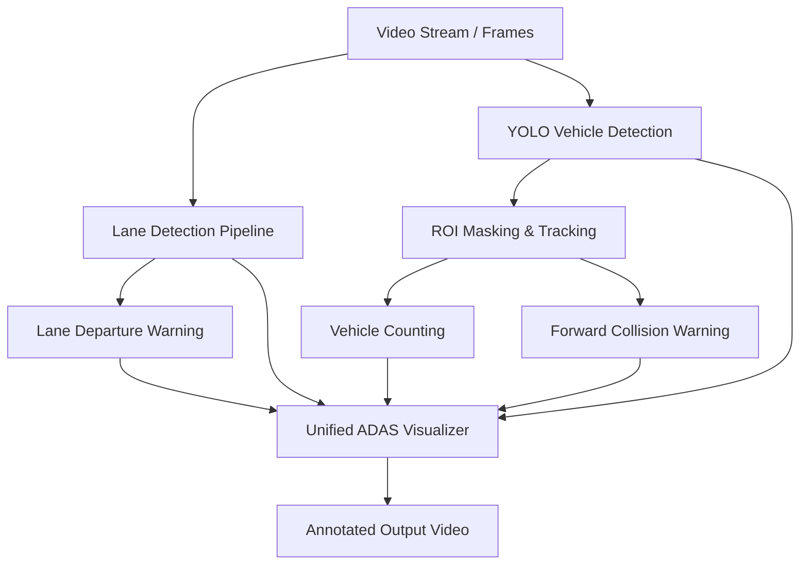

# Implementation Plan - Vision-Based Advanced Driver Assistance System (ADAS)

This document outlines the design and implementation plan for a vision-based ADAS system that performs real-time lane detection, YOLO-based vehicle tracking, ROI-masked traffic analysis, vehicle counting, forward collision risk estimation, and lane departure warning on driving videos.

## User Review Required

> [!IMPORTANT]
> The system requires downloading a sample driving video (like the Udacity self-driving project video) since the Kaggle dataset is not pre-downloaded and requires Kaggle credentials. We will provide a downloader script to fetch a public road driving video to test the pipeline.

## Proposed Changes

We will create a structured Python project with modular components for each ADAS subsystem.

### Component Breakdown

---

### [NEW] [requirements.txt](file:///c:/Users/surya/Desktop/Antigravity/Vision%20Drive/requirements.txt)
Defines project dependencies.
- `numpy`
- `opencv-python`
- `ultralytics` (includes YOLO and PyTorch dependencies)
- `matplotlib`

---

### [NEW] [lane_detector.py](file:///c:/Users/surya/Desktop/Antigravity/Vision%20Drive/src/lane_detector.py)
Handles all classical image processing for lane lines.
- **Color Masking**: Converts frames to HSL/HSV to filter white and yellow lane lines under varying light/weather conditions.
- **Edge Detection**: Sobel operator in x-direction combined with color masks.
- **Perspective Transform**: Warps frame to a "bird's-eye view" using a trapezoidal region of interest.
- **Polynomial Fitting**: Uses sliding windows and peak histograms to fit 2nd-order curves ($x = Ay^2 + By + C$).
- **Offset & Lane Departure Warning**: Computes horizontal distance between vehicle center and lane center. Generates warnings if deviation exceeds $0.3\text{m}$.

---

### [NEW] [tracker.py](file:///c:/Users/surya/Desktop/Antigravity/Vision%20Drive/src/tracker.py)
A lightweight bounding-box tracker (using Intersection over Union - IOU) to assign unique track IDs to detected vehicles.
- Matches current YOLO detections with existing tracks.
- Manages track lifecycle (birth, persistence, death).
- Helps track whether a vehicle has already been counted.

---

### [NEW] [vehicle_detector.py](file:///c:/Users/surya/Desktop/Antigravity/Vision%20Drive/src/vehicle_detector.py)
Integrates YOLOv8 object detection with ROI masking and safety warnings.
- **YOLOv8 Inference**: Detects cars, trucks, buses, and motorcycles using a lightweight pretrained model (`yolov8n.pt`).
- **ROI Masking**: Defines a polygon zone ahead of the vehicle. Checks if vehicle bottom-centers lie within the ROI.
- **Vehicle Counting**: Registers vehicle tracks when they first enter the ROI.
- **Collision Warning (FCW)**: Monitors vehicle scale (width/area) and vertical position ($y_2$ coordinate) within the ROI. Triggers warnings for close vehicles.

---

### [NEW] [visualizer.py](file:///c:/Users/surya/Desktop/Antigravity/Vision%20Drive/src/visualizer.py)
Combines all computed overlays into a single annotated frames.
- Draws semi-transparent green overlay for the drivable lane area.
- Draws lane boundaries and lane center.
- Highlights the ROI mask with a semi-transparent color overlay.
- Draws tracked vehicle bounding boxes (green/orange/red depending on collision risk).
- Displays a premium HUD showing stats (vehicle count, deviation offset, warning messages, and system mode).

---

### [NEW] [main.py](file:///c:/Users/surya/Desktop/Antigravity/Vision%20Drive/src/main.py)
The system entry point.
- Parses command line arguments (video path, output path, show live, etc.).
- Initializes the lane detector, vehicle detector, tracker, and visualizer.
- Processes the video frame-by-frame and outputs performance statistics (average processing FPS).

---

### [NEW] [download_video.py](file:///c:/Users/surya/Desktop/Antigravity/Vision%20Drive/download_video.py)
Helper script to download a high-quality road driving video (e.g., Udacity project video) to test the ADAS system.

---

### [NEW] [run_adas.bat](file:///c:/Users/surya/Desktop/Antigravity/Vision%20Drive/run_adas.bat)
A batch file script to setup the environment, install requirements, download the sample video, and run the pipeline.

## Verification Plan

### Automated Tests
1. Run pip installation:
   `pip install -r requirements.txt`
2. Download sample video:
   `python download_video.py`
3. Run the ADAS system pipeline:
   `python src/main.py --input project_video.mp4 --output output_adas.mp4`
4. Verify the output file `output_adas.mp4` is created and runs successfully.

### Manual Verification
- Play the output video to check:
  - Lane lines overlay accuracy (drivable lane region stays within physical lanes).
  - YOLO bounding boxes detect cars/trucks reliably.
  - Bounding boxes turn orange/red inside the ROI.
  - Unique vehicle counter increments correctly as cars enter the ROI.
  - Collision warnings trigger when cars get too close.
  - Lane departure warning displays when vehicle drifts left/right.
